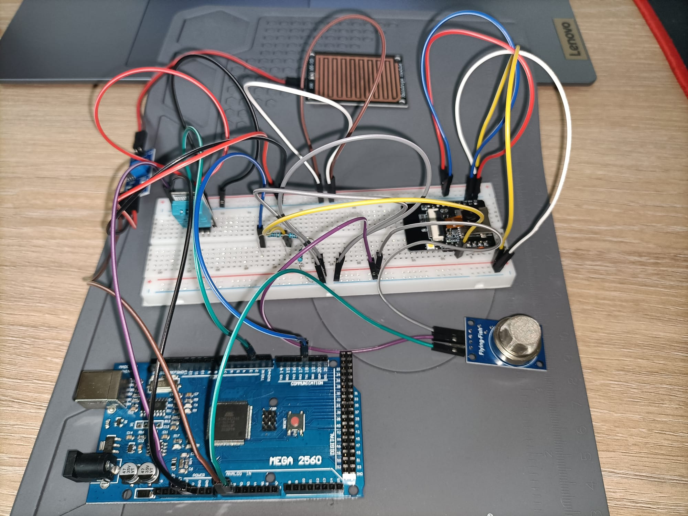
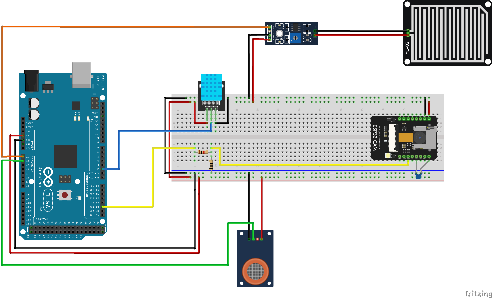
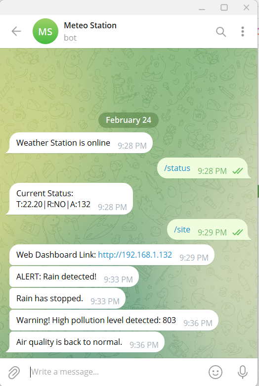

# ESP32-Arduino-Weather-Station
A wireless environmental monitoring system based on Arduino Mega 2560 and ESP32-CAM that measures temperature, rain presence and air quality and provides real-time updates through a Telegram bot and a web dashboard.

## Project overview:
This project implements a wireless environmental monitoring station using two microcontrollers.
The Arduino Mega reads sensor data and sends it to the ESP32, which provides remote access through WiFi.

## Features:
- Real-time Monitoring: Tracks temperature, rain presence, and air quality (pollution levels).
- Arduino Mega 2560: Acts as the data acquisition layer, reading analog and digital signals from sensors.
- ESP32-CAM: Acts as the communication bridge, hosting a local Web Server for the dashboard and interfacing with the Telegram Bot API for remote alerts.
- Telegram Alerts: Sends immediate warnings for rain detection or high pollution and confirms when conditions return to normal.
- Interactive Commands: Use /status to get instant readings or /site to get the dashboard link via Telegram.
- Web Dashboard: Accessible via local IP to view current conditions in any browser.

## Hardware components:
- Arduino Mega 2560
- ESP32-CAM
- DHT11 Temperature Sensor
- MQ-135 Air Quality Sensor
- Rain Sensor Module
- 1kΩ resistor
- 2kΩ resistor
- 100nF capacitor
- Jumper wires
- Breadboard

## Wiring diagram:
The circuit diagram below shows the hardware connections used in this project.
The Arduino Mega is responsible for reading the sensors, while the ESP32 handles wireless communication.

Main connections:
- DHT11 -> Arduino Pin 2
- Rain Sensor -> Arduino A0
- MQ135 -> Arduino A1
- Arduino TX1 (Pin 18) -> ESP32 RX
- Common GND between Arduino and ESP32

A voltage divider is used between the Arduino Mega and the ESP32.
The Arduino Mega uses 5V logic levels, while the ESP32 uses 3.3V logic levels.  
Direct connection could damage the ESP32.
To safely connect the boards, a voltage divider made of two resistors is used:
- R1 = 1kΩ
- R2 = 2kΩ
  
The divider reduces the Arduino TX signal from 5V to approximately 3.3V, which is safe for the ESP32 RX pin.

A 100nF capacitor is added near the sensors to improve signal stability.
The capacitor helps to:
- Reduce electrical noise
- Stabilize sensor readings
- Filter small voltage fluctuations
  
This is especially useful for analog sensors such as the MQ135 air quality sensor.

## Web Interface and Telegram Bot
The ESP32 uses a Telegram bot to provide remote monitoring and alert notifications.
The bot allows the user to check the current environmental conditions and receive automatic warnings when important changes are detected.
The Telegram bot supports the following commands:
- /status  (returns the latest sensor data received from the Arduino)
- /site  (returns the address of the web dashboard hosted on the ESP32)

Alerts are generated when:
- Rain is detected
- Rain stops
- Air pollution becomes high
- Air quality returns to normal

The ESP32 hosts a simple web server that displays real-time sensor data.
The web page automatically refreshes every 5 seconds.
The dashboard shows:
- Temperature
- Rain status
- Air quality

